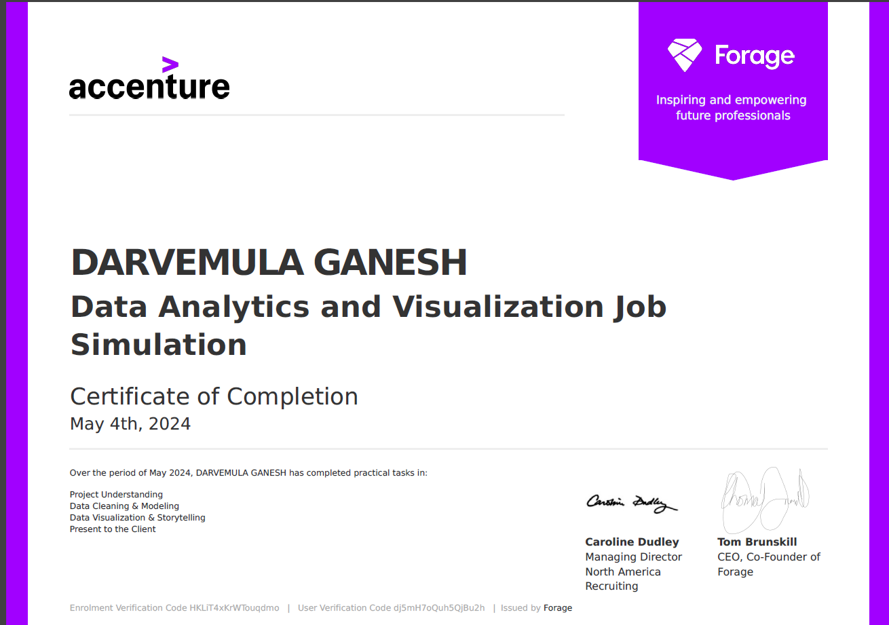

# Data Analytics

#### Technical Skills: Python, SQL, MATLAB, informatica, Pandas

## Education						       		
- PGDM., Markering & Operations	| Siva Sivani Institute of Management (_May_2022_)			        		
- B.Tech., Mechanical | Anutrtag college of Enginerring (_August_2020)

## Work Experience
**Business Analyst @ Tata Consultancy Services (_July2022 - Present_)**
-	Designed and developed data pipelines to acquire, clean and process data.
-	Performed gap analysis between existing systems or processes and desired state, identifying areas for improvement or enhancement.
-	Collaborated with teams in product line transition to streamline manufacturing footprint.
-	Collaborated closely with stakeholders to identify opportunities for process improvements and drive continuous innovation in the organization.
-	Improved business processes by analyzing current practices and recommending optimization strategies.
-	Collaborated with cross-functional teams on projects to ensure alignment of objectives and outcomes
-	Identified risks associated with new products and developed strategies to mitigate them
-	Developed a customer segmentation model that identified key customer segments and their growth potential 

**Planning Intern @ Amritha Tool Craft Pvt.Ltd (_January2021 - January 2021_)**
- Helped meet changing demands by recommending improvements to business systems or procedures.
- Optimized customer experience by delivering superior services and effectively troubleshooting issues.
- Collaborated cross-functionally with planning and other teams to cement partnerships and achieve mutual goals.
- Conducted site assessments to verify plan accuracy and feasibility of proposed developments.
- Provided reporting for forecast analysis and ad-hoc reporting in support of decision-making.

## Certifications 
### Power BI Job Simulation - Pwc

- Completed a job simulation where I strengthened my PowerBI skills to better
   understand clients and their data visualisation needs.
- Demonstrated expertise in data visualization through the creation of Power BI
   dashboards that effectively conveyed KPIs, showcasing the ability to respond
   to client requests with well-designed solutions.
- Strong communication skills reflected in the concise and informative email
   communication with engagement partners, delivering valuable insights and
   actionable suggestions based on data analysis.
- Leveraged analytical problem-solving skills to examine HR data, particularly
   focusing on gender-related KPIs, and identified root causes for gender
   balance issues at the executive management level, highlighting a commitment
   to data-driven decision-making.
  
 ### Data Analytics and Visualization Job - Accenture

 - Completed a simulation focused on advising a hypothetical social media client
   as a Data Analyst at Accenture
 - Cleaned, modelled and analyzed 7 datasets to uncover insights into content
   trends to inform strategic decisions
 - Prepared a PowerPoint deck and video presentation to communicate key insights
   for the client and internal stakeholders

   
 
 ### Data Science Job Simulation - BCG X

 - Completed a customer churn analysis simulation for XYZ Analytics,
   demonstrating advanced data analytics skills, identifying essential client
   data and outlining a strategic investigation approach.
 - Conducted efficient data analysis using Python, including Pandas and NumPy.
   Employed data visualization techniques for insightful trend interpretation.
 - Completed the engineering and optimization of a random forest model,
   achieving an 85% accuracy rate in predicting customer churn.
 - Completed a concise executive summary for the Associate Director, delivering
   actionable insights for informed decision-making based on the analysis.
 
 ### Data Visualisation Empowering Business - TATA

- Completed a simulation involving creating data visualizations for Tata
   Consultancy Services
- Prepared questions for a meeting with client senior leadership
- Created visuals for data analysis to help executives with effective decision
   making
   
 ### GenAI Job Simulation - BCC X
 
 - Completed a job simulation involving AI-powered financial chatbot development
   for BCG's GenAI Consulting team.
- Gained experience in Python programming, including the use of libraries such
   as pandas for data manipulation.
- Integrated and interpreted complex financial data from 10-K and 10-Q reports,
   employing rule-based logic to create a chatbot that provides user-friendly
   financial insights and analysis.

